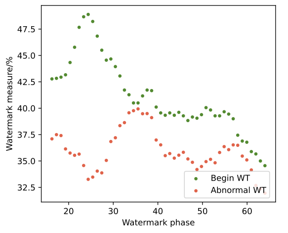
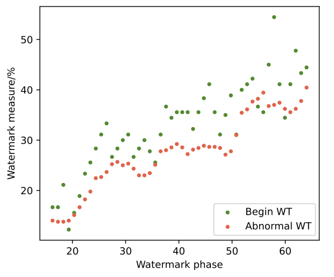

---
<p align="center">
  
</p>

# Privacy-Preserving Proof-of-Learning via Watermark Trajectory (WT-PoL)

## Introduction

Welcome to the official repository of the "Privacy-Preserving Proof-of-Learning via Watermark Trajectory" project. Our work introduces an innovative Proof-of-Learning (PoL) method, WT-PoL, which is hinged on a unique watermarking mechanism we call "watermark trajectory". This method is specifically designed for scenarios where ensuring the integrity and authenticity of the learning process is critical.

### Key Features

- **Watermark Trajectory**: A novel approach that alternates between embedding and removing watermarks during training.
- **Abnormal Training Detection**: Tracks abnormal iterations in training and adjusts the watermark trajectory accordingly.
- **High Accuracy**: Demonstrates up to 100% accuracy in detecting abnormal training iterations, even with as low as 0.05 proportion of such iterations.
- **Minimal False Accusations**: Designed to minimize false positives in abnormal training detection.

## Supplementary Experiments Results
### The Watermark Trajectory Proof on Transformer (ViT-Base-Patch32-128)



### The Watermark Trajectory Proof with Data Augmentation on GTSRB



## How WT-PoL Works

WT-PoL operates by creating multiple sub-trajectories throughout the training process. Each sub-trajectory monitors different stages of training, specifically targeting abnormal training iterations. By making the watermark sensitive to these abnormalities, any deviation from the normal training process is quickly detected, ensuring the integrity of the learning process.

## System Requirements

**Python Version**: Python 3.8
**PyTorch Version**: PyTorch 1.8.1

## Environment Dependencies

Create your enviroment for WT-PoL using the following command:

```bash
conda env create -f environment.yml
```

## The Data Resources

The data utilzied in this paper, CelebA and GTSRB, are open-source databases that need to be downloaded manually. Please refer to the data download sources provided in https://github.com/Ekko-zn/IJCAI2022-Backdoor.

## Running the Code
WT-PoL is designed for integrity verification of training, rather than consisting of separate training and evaluation phases. Each run will generate p-values for a benign training process and an abnromal training process, which is related to the WT-PoL(*) proofs (please refer to the `.tsv` files in the `follow_log/./results` directory). Users need to manually judge the completeness of each piece of proof based on the thresholds provided in the paper.

To run the WT-PoL system, follow these steps in your terminal or command prompt:

**Notification**: Before running each step, please check the parser's `help` and `annotations` in `config.py`. Some hyper-parameters need to be set mannually.

1. **Generate the Initial Watermark**: 
   ```bash
   python 1train_wm_generator.py
   ```

2. **Train the Anti-Watermark Generator**: 
   ```bash
   python 2train_anti_wm_generator.py
   ```

3. **Select Pivot Samples**: 
   ```bash
   python 3pivot_sample_selection.py
   ```

4. **Generate the Proof**: 
   ```bash
   python 4run_proof_generation.py
   ```

5. **Run the Verification Process**: 
   ```bash
   python 5run_verification.py
   ```
   
## Assets and Licensing Information

This project makes use of the following datasets and models, each with their respective licensing and usage terms:

**CelebA Dataset**

The CelebA dataset is available for non-commercial research purposes only. Please refer to the [CelebA website](http://mmlab.ie.cuhk.edu.hk/projects/CelebA.html) for detailed terms of use.

**GTSRB Dataset**

The GTSRB (German Traffic Sign Recognition Benchmark) dataset is available for research purposes. For more details, please see the [GTSRB website](http://benchmark.ini.rub.de/?section=gtsrb&subsection=news).

**DenseNet201**

The DenseNet201 model is provided by the [Keras library](https://keras.io/api/applications/densenet/). It is available under the Apache License 2.0. See the [LICENSE file](https://github.com/keras-team/keras/blob/master/LICENSE) for details.

**ResNeXt101-64x4d**

The ResNeXt101-64x4d model is provided by the [PyTorch library](https://pytorch.org/). It is available under the BSD 3-Clause License. See the [LICENSE file](https://github.com/pytorch/vision/blob/main/LICENSE) for details.

Please ensure that you comply with the licensing terms of each asset used in this project.

